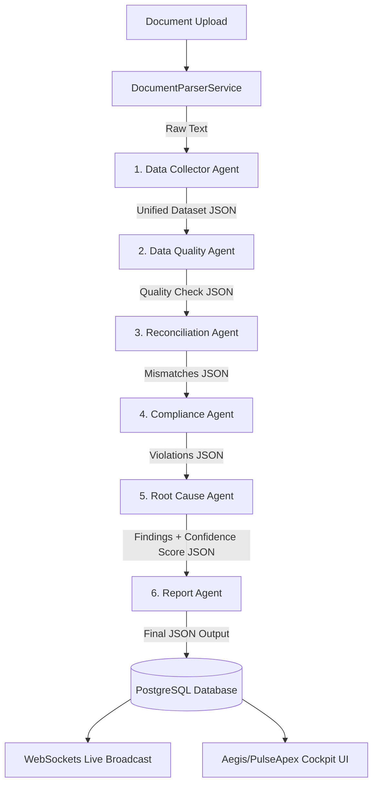

# CrewAI Data Flow and Agent Architecture

This document explains the multi-agent orchestration, data flow, component configurations, and Human-in-the-Loop (HITL) architecture inside the **Aegis AI / PulseApex** backend.

---

## 1. CrewAI 6-Agent Component Chart

The pipeline operates sequentially, passing structured context from one specialized agent to the next:

| Stage | Agent Name & Role | Model (via OpenRouter) | Goal & Backstory | Output / Hand-off |
| :--- | :--- | :--- | :--- | :--- |
| **1** | **Data Collector**   `Enterprise Data Collector Specialist` | `google/gemma-4-31b-it:free` | Extract and standardize raw data from Excel, PDF, Images, SQL, ERP, and APIs into a Unified Dataset. | **Unified Dataset JSON** containing: `title`, `parties`, `date`, `amount`, `currency`, `signed`, `key_clauses`, and `document_type`. |
| **2** | **Data Quality Agent**   `Data Quality Auditor` | `cohere/north-mini-code:free` | Identify null values, duplicate records, missing fields, and invalid formats in the unified dataset. | **Data Quality Issues JSON List** (e.g. empty `[]` if the dataset is clean). |
| **3** | **Reconciliation Agent**   `Enterprise Reconciliation Specialist` | `cohere/north-mini-code:free` | Compare the unified dataset against external sources like ERP, Ledgers, and POs to find mismatches. | **Mismatch Findings JSON Array** with keys: `severity`, `category`, `title`, `description`, `original_value`, `proposed_value`. |
| **4** | **Compliance Agent**   `Corporate Compliance Auditor` | `cohere/north-mini-code:free` | Cross-reference the unified dataset against DB compliance policies (e.g., SOC2, GST rules) and internal controls. | **Combined Violations & Mismatch JSON Array** including page numbers and policy references. |
| **5** | **Root Cause Agent**   `Enterprise Root Cause Specialist` | `openai/gpt-oss-120b:free` | Analyze compliance violations and mismatches, determine their root cause, and assign a confidence score. | **Enriched Findings JSON Array** with the likely cause appended to the description, plus an `ai_confidence_score` (0-100). |
| **6** | **Report Agent**   `Reporting Director` | `cohere/north-mini-code:free` | Compile the final verified array of findings and filter out false positives. | **Final Validated JSON Array of Findings** ready for database insertion. |

---

## 2. Step-by-Step Data Flow

1. **Ingestion & Parsing**: A document (PDF, Excel, Word, etc.) is uploaded. The `DocumentParserService` parses it to extract raw text content.
2. **Sequential Multi-Agent Execution**: The six agents run in sequence using CrewAI's `Process.sequential` flow. The output of each agent is fed as context to the subsequent agent's task.
3. **Log & State Streaming**: Throughout the run, each agent's active steps, thoughts, and messages are persisted in the database (`AgentLog` and `AgentRun` tables) and broadcast in real-time via WebSockets.

---

## 3. Output Handling & Format

The output is **not** a raw PPT or generic text chat. It is structured, high-integrity **JSON data** that is automatically written to your relational database.

* **Database Persistence**: The final array is stored in the `AuditFinding` table (columns include `severity`, `category`, `title`, `description`, `original_value`, `proposed_value`, `compliance_reference`, and `ai_confidence_score`).
* **Compliance Score Calculation**: The backend calculates a total `compliance_score` (starting at 100 and deducting points based on findings: 25 for critical, 15 for high, 8 for medium, 3 for low).
* **The Frontend Dashboard Presentation**: The React/Next.js dashboard (the "Cockpit") ingests this JSON data from the database and renders:
  * An interactive **Compliance Gauge**.
  * Finding detail cards showing the mismatch (e.g., "Original Value: Signed: [BLANK]" vs "Proposed Value: Dual Signatures").
  * Actionable buttons to approve/reject remediation patches.
  * Real-time WebSocket terminal logs showing what the agents did step-by-step.

---

## 4. The Patch Agent & Human-in-the-Loop (HITL) Workflow

The Human-in-the-Loop mechanism is triggered directly by the Root Cause/Patch Agent based on confidence thresholds:

### Step A: Confidence Threshold Check (Root Cause Agent)
When the **Root Cause Agent** assesses a finding, it assigns an `ai_confidence_score` (between `0` and `100`):
* **High Confidence (>= 90%)**: The finding is automatically resolved/applied.
* **Low Confidence (< 90%)**: If any finding has a confidence level below 90%, the agent flags it. The system creates an `ApprovalRequest` in the database and pauses the audit status (setting it to `paused`).

### Step B: Human Review (The Cockpit UI)
1. The pending approval request appears on the human auditor's dashboard.
2. The auditor reviews the mismatch, the proposed remediation (the "patch"), and the agent's explanation.
3. The human enters correction notes and clicks **Approve** or **Reject**.

### Step C: Cognitive Memory Generation (Agentic RAG)
When the human submits their decision, a vector embedding of the correction is created:
* The system combines the anomaly details and human notes: `"Anomaly: [Title] - [Description]. Human Correction: [User Notes]"`.
* It calls OpenAI's `text-embedding-3-small` model to create a vector.
* The vector is saved in `HumanCorrectionVector` (utilizing `pgvector` inside PostgreSQL).
* **Cognitive Learning**: In future runs, the compliance agents query this vector database using semantic similarity search to see how a human previously resolved similar issues. This allows the agents to "learn" and align their recommendations with the human auditor over time.

### Step D: Resuming the Pipeline
Once all pending approvals for a paused audit are resolved by a human, the backend triggers `resume_audit_after_hitl()`, which transitions the audit status to `completed` and lets the **Report Agent** finalize the audit reports.
