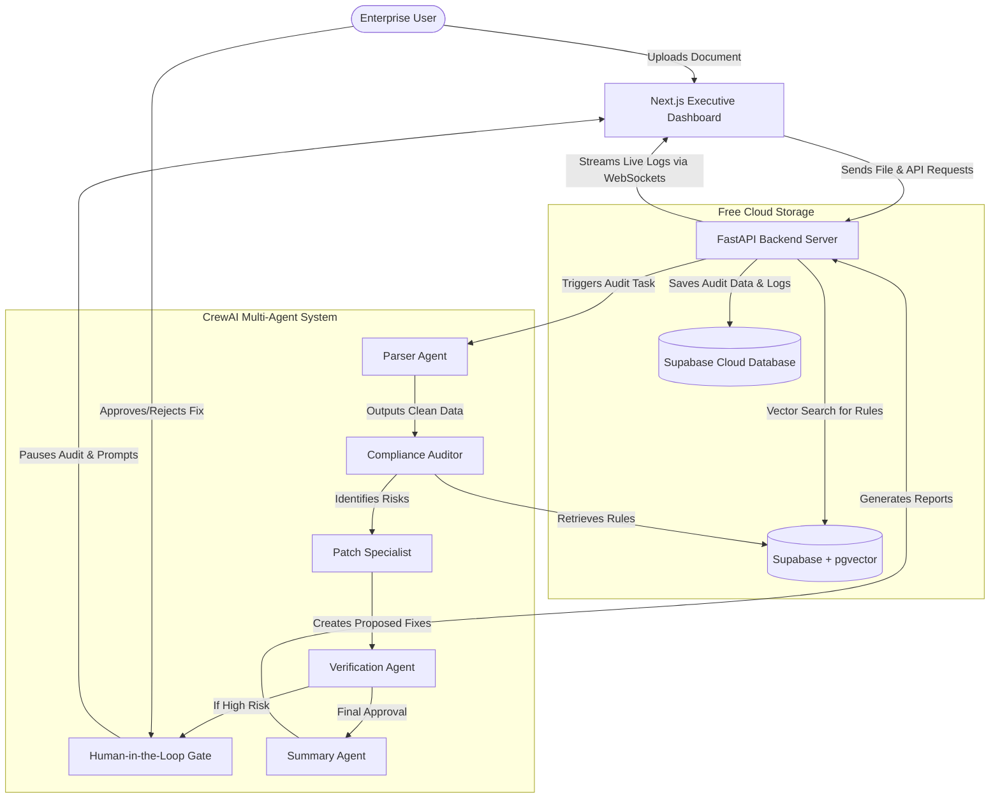

# Implementation Plan - PulseApex: Autonomous Corporate Document & Financial Auditing Network

Welcome! Since you mentioned you don't have a background in coding, this document is designed to guide you through what we are building, how the parts connect, and the steps we will take to make it work. 

---

## 1. What is PulseApex? (Simplified Explanation)
Imagine you have a team of professional auditors, accountants, and lawyers. When you upload a corporate document (like an invoice, contract, or spreadsheet), they work together to inspect it, verify signature lines, check for matching numbers, compare it against regulations, flag issues, and suggest corrections.

**PulseApex** is an automated software version of that team. Instead of human workers, it uses **AI Agents** (specialized AI bots) that talk to each other to review documents.

### How the Components Work Together:
1. **The Frontend (The Dashboard)**: The visual website you click and type on. It is designed with a sleek, premium dark theme, like a trading terminal, where you upload documents and watch the AI work in real time.
2. **The Backend (The Engine)**: The behind-the-scenes server. It receives files, saves them, tells the AI agents to start working, and sends status updates back to the website.
3. **The Databases (The Memory)**:
   - **Supabase (Cloud PostgreSQL)**: A free, cloud-hosted database that stores structured info like user profiles, document lists, audit results, and logs.
   - **pgvector (Supabase Extension)**: A free extension built into Supabase that turns our database into a smart AI search engine. It reads reference documents (like the US Tax Code or internal company policies) and helps the AI "search" for relevant rules in milliseconds. This avoids the need for any paid cloud databases (like Pinecone) and runs entirely in the cloud for free.
4. **CrewAI (The Agent Network)**: The team of specialized AI bots (Parser, Auditor, Patch Specialist, Verification Agent, Executive Summarizer) collaborating to complete the audit.

---

## 2. Proposed System Architecture

Here is how data flows through PulseApex:



---

## 3. Database Schema Design
We will structure our Supabase (PostgreSQL) database with the following tables. Here is a simple explanation of what each table stores:

*   **`organizations`**: Information about the enterprise customer (e.g., "Acme Corp").
*   **`users`**: User login details, encrypted passwords, and multi-factor authentication (MFA) details.
*   **`roles` & `permissions`**: Controls who can view, edit, or approve documents (Role-Based Access Control).
*   **`documents` & `document_versions`**: Records of every file uploaded, including size, status, and older versions if updated.
*   **`audits`**: The main record of an auditing job (when it started, finished, and its current health score).
*   **`audit_findings`**: Specific errors found in a document (e.g., "Missing signature on page 4", "Suspicious transaction of $50,000").
*   **`agent_runs` & `agent_logs`**: Timestamps and step-by-step thoughts of the AI agents as they inspect files.
*   **`approval_requests`**: Temporary holds when a high-risk issue is found, waiting for a human manager to click "Approve" or "Reject".
*   **`compliance_rules`**: External rules (like SOC2, GDPR, or corporate policy guidelines) that the documents are measured against.
*   **`audit_trails`**: Security records of who did what and when, ensuring the system is ready for formal corporate audits (SOC2 readiness).
*   **`embeddings_metadata`**: Vectors (AI embeddings) of reference policies stored inside our free Supabase database for matching.

---

## 4. Proposed Folder Structure
To make our application clean and production-ready, we will separate the codebase into two main directories: `frontend` (the visual dashboard) and `backend` (the AI logic and API server).

```text
pulseapex-ai/
├── backend/                  # Python API & AI Agent Code
│   ├── app/
│   │   ├── api/              # API Endpoints (Auth, Upload, Audit, HITL)
│   │   ├── core/             # Security, JWT auth, database connections
│   │   ├── models/           # PostgreSQL Database Schemas
│   │   ├── services/         # Business logic (pgvector RAG integration, File parsing)
│   │   ├── agents/           # CrewAI Agents & Task definitions
│   │   └── websockets/       # Real-time message streaming
│   ├── tests/                # Automated tests
│   ├── Dockerfile
│   ├── requirements.txt      # Python dependencies
│   └── docker-compose.yml    # Runs database, backend, and redis locally
└── frontend/                 # Next.js 15 Website Dashboard
    ├── src/
    │   ├── app/              # Dashboard pages (Workspace, Audit Center, Login)
    │   ├── components/       # Custom premium visual widgets (Gradients, Heatmaps, Timelines)
    │   ├── hooks/            # Fetching data and connecting WebSockets
    │   └── store/            # State management (using Zustand)
    ├── package.json
    ├── tailwind.config.js
    └── Dockerfile
```

---

## 5. Development Checklist & Step-by-Step Plan

We will build PulseApex in 5 sequential phases. 

### Phase 1: Set Up Backend Foundation & Database (Steps 1-3)
*   **Step 1**: Initialize the Python FastAPI project and configure the database connection (connecting to Supabase).
*   **Step 2**: Create the complete database schema (including vector storage) and set up migrations (Alembic) to deploy them to Supabase.
*   **Step 3**: Implement secure user registration, JWT login, and role management.

### Phase 2: AI Multi-Agent & RAG Network (Steps 4-6)
*   **Step 4**: Code the **CrewAI Multi-Agent System** defining the 5 agents (Parser, Auditor, Patch Specialist, Verification, Summarizer) and their instructions.
*   **Step 5**: Integrate **pgvector RAG** (Retrieval-Augmented Generation) so the Auditor agent can search for company policies directly from Supabase.
*   **Step 6**: Implement file upload parsing for Excel, CSV, PDF, and DOCX files.

### Phase 3: Real-Time Engine & Human-in-the-Loop (Steps 7-8)
*   **Step 7**: Set up **WebSockets** in FastAPI to broadcast agent "thoughts" and logs in real-time.
*   **Step 8**: Develop the **Human-in-the-Loop (HITL) gate**, which freezes the agent workflow when a high-risk violation is found and waits for a user response.

### Phase 4: Premium Dark-Themed Frontend (Steps 9-11)
*   **Step 9**: Initialize the Next.js 15 project with TypeScript and Tailwind CSS.
*   **Step 10**: Build the **Executive Dashboard**, **Audit Workspace**, and **HITL Review Center** with a futuristic dark theme, custom compliance charts, and risk heatmaps.
*   **Step 11**: Connect the frontend to the backend via WebSockets to animate the AI Agent Activity feed in real time.

### Phase 5: Testing, Reports, & DevOps (Steps 12-14)
*   **Step 12**: Add Excel, CSV, and PDF export functionalities for generated audit reports.
*   **Step 13**: Setup Docker Compose to run Redis, Backend, and Frontend locally with one command, using Supabase as our data storage.
*   **Step 14**: Create GitHub Action workflows and write the production deployment guide.

---

## 6. Verification Plan

We will verify our system through:
1.  **Automated Backend Tests**: Creating test scripts that mock document audits and verify that the database entries are populated correctly.
2.  **Live Visual Walkthrough**: Testing file uploads (e.g. uploading a sample contract and a sample spreadsheet) and watching the agents audit them, trigger a human-in-the-loop popup, and output reports.

---

## 7. Open Questions for You
Please review the questions below. Your answers will help tailor the platform to your requirements:

> [!IMPORTANT]
> **Q1: AI Provider**
> Do you have a preferred AI model provider we should connect to? (e.g., OpenAI GPT-4, Google Gemini, or a local model like Llama 3)? We can set up the configuration to support any of them via API keys, but having a target helps design the system prompts.
> 
> **Q2: Document Rules & Guidelines**
> Should we include a pre-loaded set of default audit policies (e.g., "Verify that all invoices over $10,000 have an authorized manager's signature") so you can test the system immediately with standard sample files?
> 
> **Q3: Local Setup / LLM preference**
> Since we are using PostgreSQL with pgvector (which is completely free and runs locally), the database is 100% free. For the AI processing, would you like us to configure a fallback mock AI response mode so that you can run the entire system offline and test it without any paid OpenAI or Gemini API keys?
