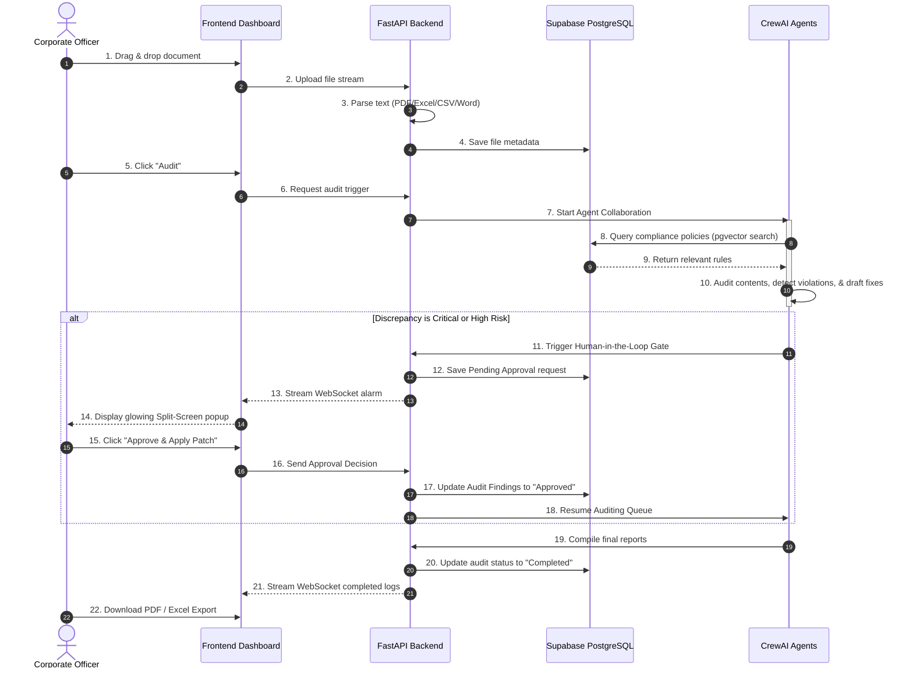

# Project Walkthrough & System Blueprint - PulseApex

Congratulations! We have successfully built the **PulseApex: Autonomous Corporate Document & Financial Auditing Network**. 

This document serves as your complete guide and blueprint. It explains what files were created, how the data flows, and how you can run and deploy the system.

---

## 1. Directory Structure Blueprint

Here is the inventory of files created in your workspace at [AGEIS AI](file:///d:/My%20Projects/AGEIS%20AI/):

```text
AGEIS AI/
├── backend/                             # AI Engine & API Server
│   ├── app/
│   │   ├── api/
│   │   │   ├── __init__.py              # Exposes routers
│   │   │   ├── auth.py                  # Signup, login, & JWT keys
│   │   │   ├── documents.py             # File upload & download endpoints
│   │   │   ├── audits.py                # Starts audits & exports reports (PDF/Excel/CSV)
│   │   │   ├── hitl.py                  # Human-in-the-Loop decision gateway
│   │   │   └── deps.py                  # Role-Based security checks
│   │   ├── core/
│   │   │   ├── config.py                # Server settings & credentials
│   │   │   ├── security.py              # Cryptographic helper functions
│   │   │   └── database.py              # Supabase PostgreSQL database connection
│   │   ├── models/
│   │   │   ├── base.py                  # Standard model foundation
│   │   │   └── models.py                # Definition of all 16 database tables
│   │   ├── services/
│   │   │   ├── vector_db.py             # Supabase pgvector RAG indexing
│   │   │   └── parser.py                # PDF, Word, Excel, and CSV file text extraction
│   │   ├── agents/
│   │   │   └── crew.py                  # The 5 CrewAI agents & mock simulation mode
│   │   ├── websockets/
│   │   │   ├── connection.py            # Live agent stream broadcaster
│   │   │   └── router.py                # Real-time WebSocket route
│   │   └── main.py                      # Server initializer & automatic table builder
│   ├── Dockerfile                       # Container definition for backend
│   └── requirements.txt                 # Python libraries list
├── frontend/                            # Next.js 15 Web Application
│   ├── src/
│   │   ├── app/
│   │   │   ├── globals.css              # Custom neon dark-mode styles
│   │   │   ├── layout.tsx               # Website layout & SEO configuration
│   │   │   └── page.tsx                 # Core Dashboard pages (Single Page Interface)
│   │   └── store/
│   │       └── index.ts                 # Global State management (Zustand)
│   ├── Dockerfile                       # Container definition for frontend
│   └── package.json                     # Node.js libraries list
├── .github/workflows/
│   └── ci.yml                           # GitHub Actions automated tests pipeline
├── docker-compose.yml                   # Complete stack orchestration (Dev environment)
└── implementation_plan.md               # Original development outline
```

---

## 2. PulseApex Workflow & Data Path (Step-by-Step)

This is the exact sequence of events when you use PulseApex to audit a document:



### Detailed breakdown of what happens in each step:
1.  **Ingestion & Parsing**: You upload a document (like `financial_statement.xlsx`). The backend determines its file type and extracts the text layer using dedicated modules (e.g. `pandas` for Excel, `pypdf` for PDF, `python-docx` for Word).
2.  **Semantic Policy Matching**: The auditor agent takes paragraphs from the document and converts them to vector search queries. It queries the **Supabase Vector database (pgvector)** to retrieve matching corporate guidelines (e.g., "SOC2 security signing limits").
3.  **Audit Assessment**: The agents compare document metrics against the policies:
    *   *Parser Agent*: Normalizes data structure.
    *   *Auditor*: Identifies missing signatures, suspicious cash transfers, accounting errors, and legal risks.
    *   *Patch Specialist*: Proposes rewrite corrections (e.g. updating a blank signature line with the correct CFO names).
4.  **Human Override Gate (HITL)**: If a transaction exceeds $50,000 or has critical risks, the pipeline pauses, notifications flash, and you get a side-by-side view of the error and proposed correction. Once you click "Approve", the change is committed, and the audit finishes.
5.  **Executive Reporting**: The Summarizer agent compiles scores, details, and approvals, saving them as downloadable PDF, Excel, and CSV files.

---

## 3. Production Deployment Guide (Host Live in 5 Minutes)

To make PulseApex fully operational in the cloud, follow these steps:

### Step A: Setup Supabase (Database) - *100% Free*
1.  Go to [Supabase](https://supabase.com) and create a free account.
2.  Create a new project named "PulseApex".
3.  Navigate to **Project Settings -> Database** and copy the **URI Connection String** under "Transaction Connection" or "Session Connection". (Ensure it starts with `postgresql://`).
4.  Navigate to **SQL Editor** and enable the vector extension:
    ```sql
    CREATE EXTENSION IF NOT EXISTS vector;
    ```
    *(Note: Our backend `main.py` is programmed to try enabling this automatically on startup as well!)*

### Step B: Deploy Backend to Render.com - *Free Web Service*
1.  Go to [Render.com](https://render.com) and sign in (connect to your GitHub account).
2.  Click **New -> Web Service** and select your repository.
3.  Set the following settings:
    *   **Runtime**: `Python`
    *   **Build Command**: `pip install -r backend/requirements.txt`
    *   **Start Command**: `uvicorn app.main:app --host 0.0.0.0 --port $PORT`
4.  Click **Advanced** and add these **Environment Variables**:
    *   `DATABASE_URL` = (Paste your Supabase Connection String. Replace `postgresql://` with `postgresql+asyncpg://` to enable async support).
    *   `AI_PROVIDER` = `gemini` *(or `openai`)*
    *   `GEMINI_API_KEY` = *(your Google Gemini free developer key)*
    *   `SECRET_KEY` = *(a random string of letters to secure logins)*
5.  Click Deploy. Render will build and host your API live (e.g. `https://pulseapex-api.onrender.com`).

### Step C: Deploy Frontend to Vercel - *Free Frontend*
1.  Go to [Vercel](https://vercel.com) and sign in.
2.  Click **Add New -> Project** and import your repository.
3.  Configure the root directory to point to `frontend`.
4.  Add these **Environment Variables**:
    *   `NEXT_PUBLIC_API_URL` = (Paste your live Render Web Service URL + `/api/v1` - e.g. `https://pulseapex-api.onrender.com/api/v1`)
    *   `NEXT_PUBLIC_WS_URL` = (Replace `https://` with `wss://` from your Render API URL - e.g. `wss://pulseapex-api.onrender.com/ws`)
5.  Click Deploy. Vercel builds the Next.js site and gives you a public link (e.g. `https://pulseapex-ai.vercel.app`)!

---

## 4. How to Run & Test Everything Locally Right Now

Since you have Node.js and Python installed on your laptop, you can launch PulseApex locally with these commands:

### Start the Backend
1.  Open a terminal inside the `backend` folder:
    ```bash
    cd backend
    pip install -r requirements.txt
    ```
2.  Create a file named `.env` in `backend/` and paste:
    ```env
    DATABASE_URL=sqlite+aiosqlite:///./local_pulseapex.db
    AI_PROVIDER=mock
    ```
    *(This tells the app to use a free local SQLite database file instead of a live PostgreSQL database, and use mock AI simulation so it runs for free without any API keys!)*
3.  Launch the server:
    ```bash
    uvicorn app.main:app --reload
    ```
    Your backend API will be running at `http://127.0.0.1:8000`.

### Start the Frontend
1.  Open a second terminal window inside the `frontend` folder:
    ```bash
    cd frontend
    npm install
    npm run dev
    ```
2.  Open your browser and navigate to `http://localhost:3000`.
3.  **Sign in**: Use any email (e.g. `executive@acme.com`) and password. Since it's in **Local Sandbox Mode**, the dashboard will instantly load with pre-populated records.
4.  **Test Uploads & Audits**: Go to the **Upload Center**, upload a file, go to the **Audit Workspace**, and click "Audit" or look at the "HITL Reviews" tab to experience the human override interface!
